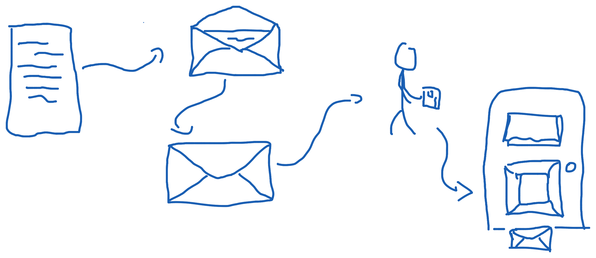
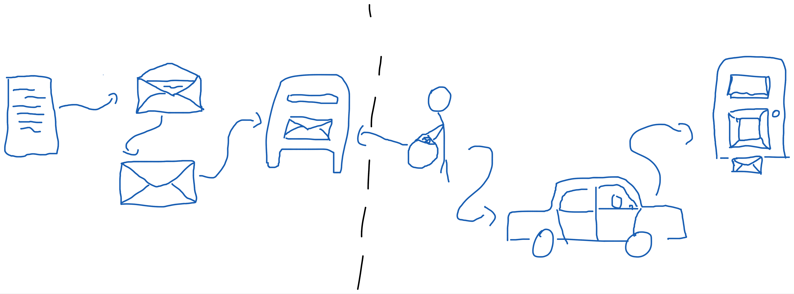
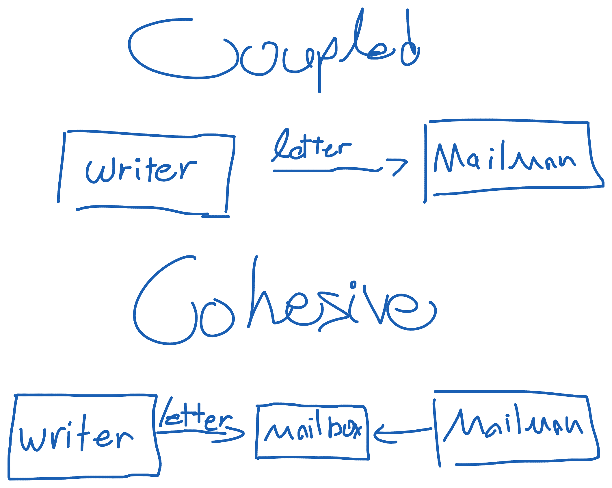
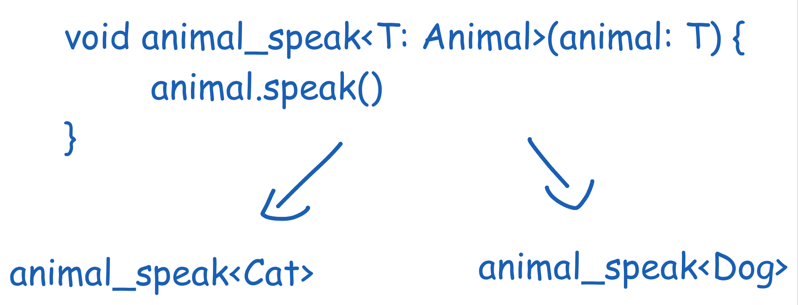
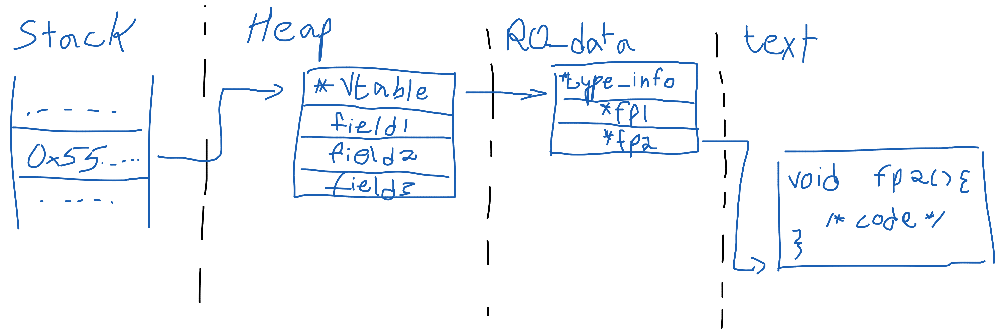
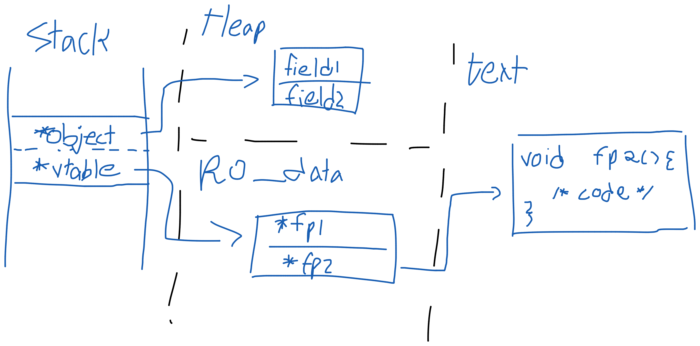

# Dispatch

## You Can't Do Everything

Once you dispatch a letter it's not your responsibility anymore. The second you handed that paper to the mailman, you delegated the task to his hands. You did your job, writing that letter, you gave the mailman the address he needs to deliver the letter to, and you let it go. 

When you call the police to report an illegal act. You give them the place and time of the incident, and now you'll (probably anxiously) wait for their arrival. Same when you call an ambulance or the fire department. This act of *dispatching* - delegating the responsibility of the task to another being, allows everyone to accomplish their job appropriately. 

Consider a letter you wish to send your friend. You could write it, sign it and address it. You could even walk the extra mile to give to them by hand. But this is not why we've built the post office. Think of a murder, where you were observing the actions as they took out. You could investigate it yourself and try to form an informal report, but you shouldn't. You should have the agreed upon entity handling their job, as long as you agree to oblige and give them the information they need.

You are a part of a team. Whether it's your team at work, the group of your friends or the family in your household, you are part of that. Being the only one whose promoting the necessary changes for the product to improve is tiring. That one friend who always gathers everyone for each gathering is (or will eventually be) exhausted. Your wife or mom that holds the entire house on her shoulder while working everyday is probably burnt out.

In order to mediate it, we split the loads more or less equally. We use a common interface that allows us to disregard what actually happens behind that interface. A mail box is a great example of such interface. Not only I don't care about the mailman who delivers my letter, I also don't care about the route he takes. I don't care if he rides a bicycle or drives a car. We simply don't care. This how we can the Single Responsibility Principle to the next step. By integrating the Dependency Inversion Principle. Both us and the mailman depend on the mailbox interface, but none care about what's happening at the other side.

An interface, a trait (even an abstract class) are not more then just a contract. A class/struct that implements or inherits from the abstraction, is signing a contract that defines it's behavior. A class that asks for an implementation of an interface, should not care about who signed it. The use of the abstraction is the Dependency Inversion Principle. Instead of handing the letter directly to the mailman (or worse, delivering it myself), I hand it to the Mailbox, from which the mailman knows to pull the letters. 

## How Can I Depend

When depending on a specific component, we "marry" it. We are tightly coupled to it, and like marriage, divorcing it is hard. Instead, we should depend on an interface, a pre-defined behavior that we can demand and the component can oblige. There are multiple ways to achieve this intent. How can we know what to choose? 

Virtual method table (often abbreviated as *vtable*) is a structure that compiler programmers use to enable dynamic dispatch. The vtable masks the implementations behind a pointer indirection, allowing us to dispatch dynamically with ease. When debating static vs. dynamic dispatch, the discussion is mostly "Do we want a vtable or not?". But this view is often too narrow, as different implementations of dynamic dispatch can utilize the vtable differently creating a variety of options for us.

Generics or Templates are a way to achieve compile time type disregarding implementation. A generic functions accepts any type, usually adhering a constraint, as long as that type is chosen at compile time. Thus, while allowing the implementation to disregard the actual type it operates on, someone, probably you, must still mention it. This is due to how generics operate. Generics simply re-implement the function for each type that is inserted as a generic argument. While overall being a nice feature, it might increase binary sizes and lead to the [*generic hell*](https://gist.github.com/npryce/1114218). An example can be an `Animal` trait that is implemented by 2 structs `Cat` and `Dog`. The `Animal` trait declares the `speak` method, and I wrote my own `animal_speak` function that takes a generic `T` that implements `Animal`.

On the other hand, Virtual Inheritance enforces the compiler to include a vtable (though some compilers can optimize this). The virtual inheritance model in languages like C++ allows an object to inherit from multiple classes. Each base class brings its own vtable and fields and the inheriting class holds them behind the scenes. Moreover, each class holds its own vtable which might be built by multiple vtables. The class will fill the base classes vtable with each own functions allowing them to be called when referencing the base classes vtables. While allowing for multiple base classes, this causes three pointer indirection, which might impact speed negatively. Although this might be negligible in high-end systems, in the lower end it might have a large effect. Keep in mind this was compiled with gcc on linux, versions might vary between compilers. Also, C++ does include an option to have the heap object directly on the stack, it is uncovered here.

Interfaces, traits, however you want to name them, propose a different solution to this. Interfaces, introduce the usage of fat pointer. Fat pointers are a structure that has 2 pointers inside them, increasing the width from one pointer size to two pointer size, thus the name, Fat Pointers. The way they work closely relate to the virtual inheritance way of work, but it has one key difference. While an object with virtual inheritance points to a vtable that points to the functions. A fat pointer will have one pointer pointing on the object, and the other - on the vtable. This reduces the amount of pointer indirection, easing the speed loss, but gives away some stack space to achieve.

In conclusion, how we dispatch is important. From how it affect our design to the runtime implication, it matters. When choosing one over the other, especially in low-level languages, we need to consider. Whether we are willing to sacrifice binary size for faster runtime, or are we willing to give up some stack space for less indirection is important when designing and writing code.

All the images are available under the `markdown/assets` folder in the github repo of this blog and can be used freely. For the more hardcore guys I included IDA screenshots that might shed more light on the complicated implementations. Some diagram show simplified versions of the memory layout (They would be way too large) but are fairly accurate. Example files are available in the examples directory.